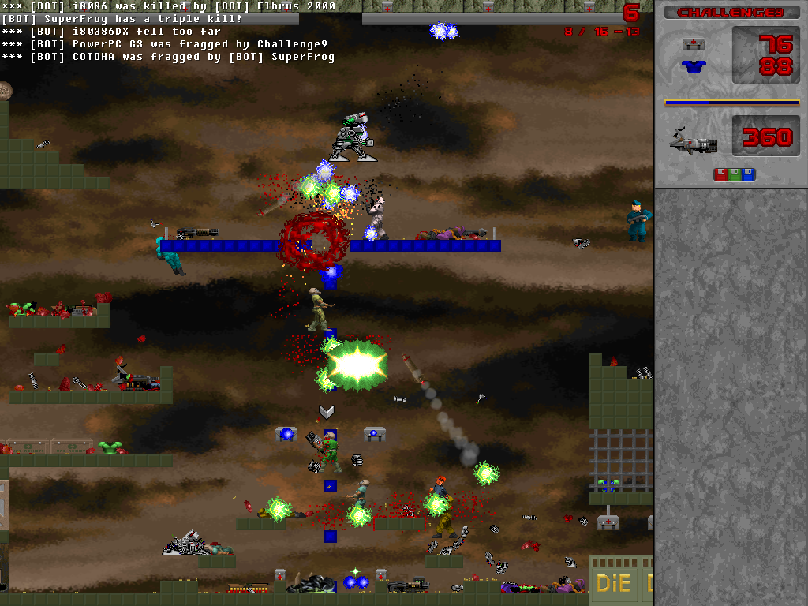
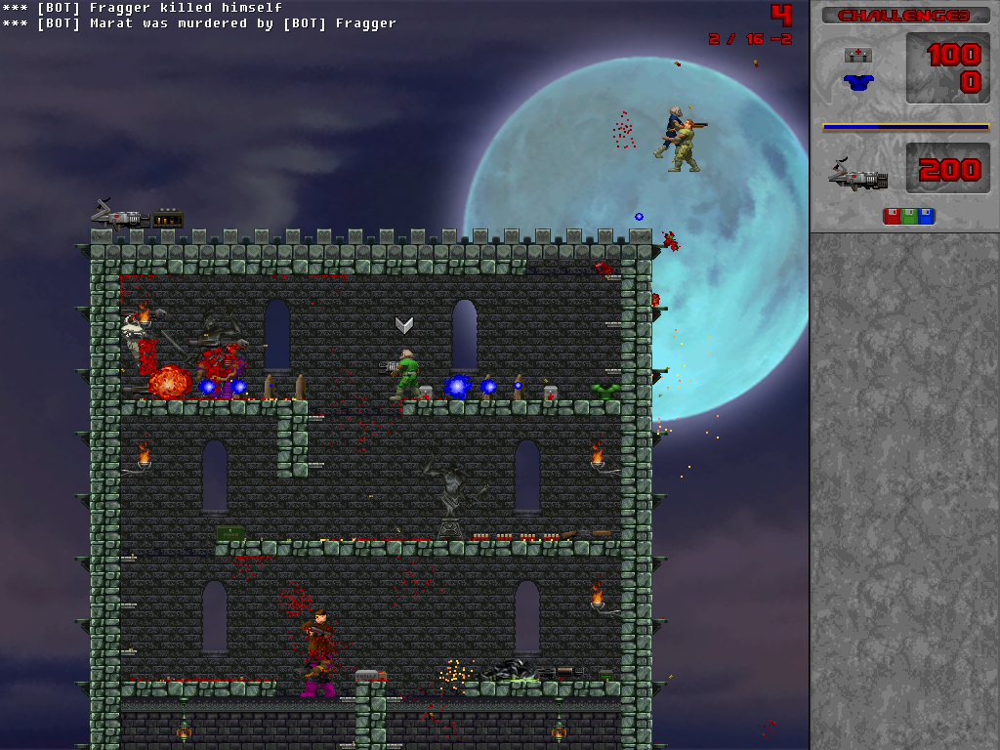
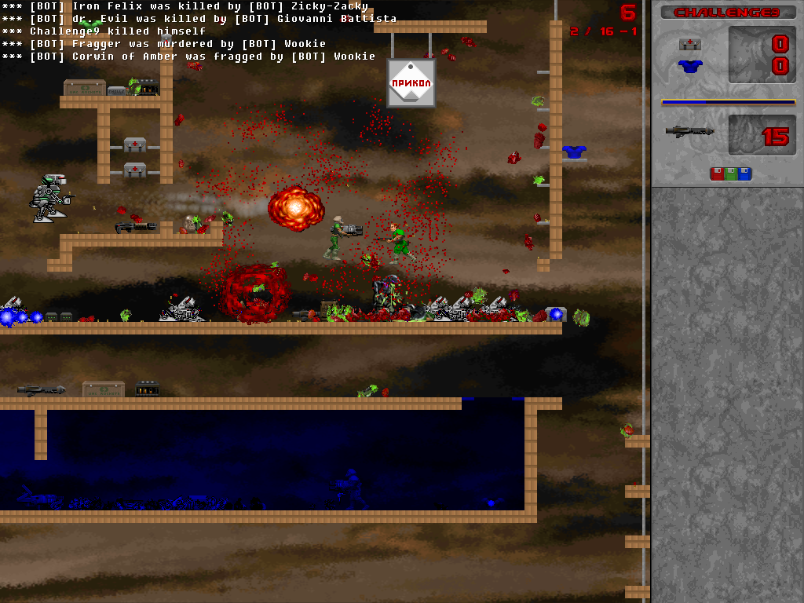

# Doom 2D Forked

## Description
**Doom 2D: Forked** is a modern version of a Russian freeware doom game Doom 2D.

This open source multiplatform project, written from scratch, is designed to reproduce the original game with significant
improvements in gameplay, graphics and logic.

This is a fork of Doom 2D: Forever, whose developers are really pelutant children.



## Install

### Flatpak
Doom 2D: Forked has a Flatpak manifest, available at (https://github.com/Challenge9/org.doom2d.forked)

## Build
```
  git clone --recurse-submodules https://github.com/Challenge9/doom2d-forked
  cd doom2d-forked
  git submodule update --init
  mkdir -p ./build/bin ./build/tmp
  bash script/game/download_essentials.sh ./build/bin
  cd src/game
  fpc -B -dUSE_SDLMIXER -FE../../build/bin -FU../../build/tmp Doom2DF.lpr
```

Windows binaries will require the appropriate DLLs (SDL2.dll, SDL2_mixer.dll or
FMODEx.dll, ENet.dll, miniupnpc.dll), unless you choose to static link them.

**NOTE** Remember to clear the cache directory (`build/tmp` by default) after you've built the game!

## Run
- If you've followed build instructions above, `../../build/bin/Doom2DF`
- If Doom2DF is installed in the system PATH, `Doom2DF`

## Screenshots

